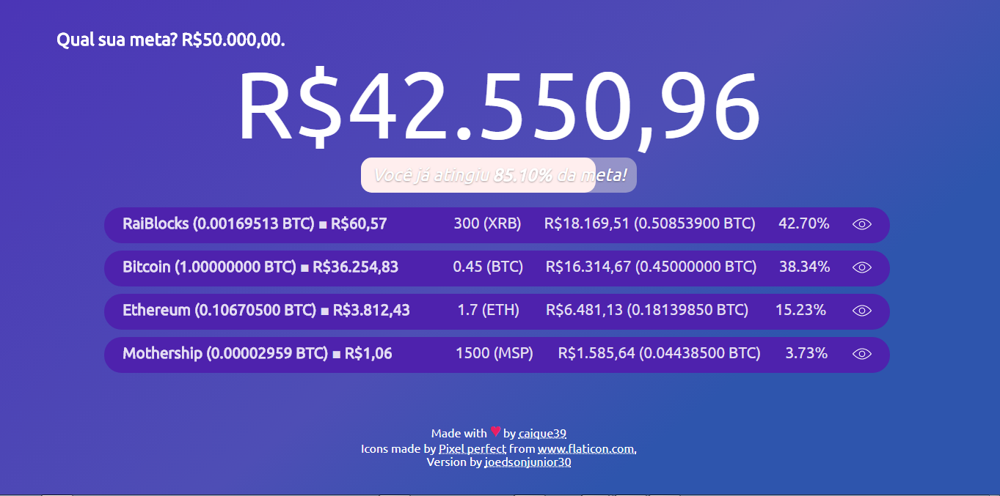

# Qual sua meta?

> Qual sua meta é simplemente uma ferramenta que ajudará você na hora de contabilizar
> o seu saldo em criptomoedas.
> Vem mostrando respectivamente, Cotação BTC ■ Fiat, moedas em posse, balanço da moeda
> em fiat e BTC, porcentagem correspondente ao total.



## Como usá-la?

> Simples! Faça download dos arquivos em seu computador, edite a variável global disponível no
> `public/index.html` e abra no seu navegador favorito! Isso é importante porque não coloca nenhuma
> referência do seu portifólio online.

### Exemplo:

```html
<script type="text/javascript">
    var MY_GOAL = {
        currency: 'BRL', // Moeda para mostragem dos valores.
        coins: { // Moedas do seu portifólio.
            bitcoin: 0.5,
            ethereum: 1.7
        },
        goal: 50000 // Sua meta!
    };
</script>
```

## Observações:

- Usamos o [CoinMarketCap] para obter os dados, portanto, o nome da moeda aqui adicionada deve corresponder com o *ID* da mesma na API;
- Foi testado apenas no Google Chrome e não está responsivo (ainda) \`:^P.
- Troque `'BRL'` para a fiat desejada.
- Assim que atingir a meta, um alerta visual chamará a atençao caso outra página esteja aberta.

### Como obter ID da moeda?

Acesse o [CoinMarketCap], pesquise sobre a moeda desejada, e confira a *URL*.
O *ID* vem logo após o termo `currencies`.

#### Exemplo:

- **Moeda**: Request Network;
- **URL**: `https://coinmarketcap.com/currencies/request-network/`;
- **Logo**, o ID é `request-network`.
- Adicione com `""` na variável global, **Exemplo:** `"request-network": 10.5`.

[CoinMarketCap]: <https://coinmarketcap.com>
